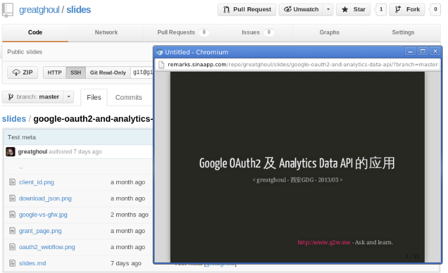

title: Introduce Remarks
name: inverse
layout: true
class: inverse

---
class: center middle

# Remarks
A simple remark slides player.

---
# What is remark

**Remark** is a simple, in-browser, markdown-driven slideshow tool targeted at people who know their way around HTML and CSS, featuring:

 * Markdown formatting, with smart extensions
 * Automatic syntax highlighting, with optional language hinting
 * Slide scaling, thus similar appearance on all devices / resolutions
 * Touch support for smart phones and pads, i.e. swipe to navigate slides
 * Check out this remark slideshow for a brief introduction.

Check out [this remark slideshow][^1] for a brief introduction.
Check out <https://github.com/gnab/remark> for more details.

[^1]: http://gnab.github.com/remark

---
# What is remarks

**Remarks** is a web application that making and playing remark slides online, featuring:

 * Play remark slides online from gist or github repositories
 * Bookmarklet to play slides easily
 * Bookmarklet to preview slides in a popup window (coming soon ...)

---
# Remarks in gist

---
# Remarks in repo

